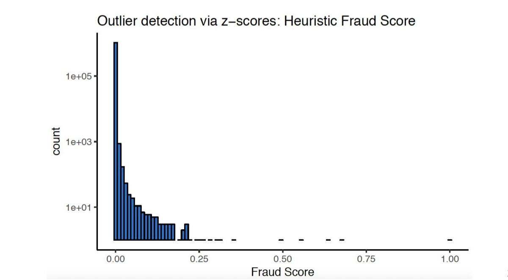

# Description of Project
In my Fraud Analytics course, my team and I performed a detailed analysis of 'New York City Property Tax Valuation Data' and identified potential fraudulent records from the data set using unsupervised machine learning methods. 

# Project Goal
Our objective was to use machine learning algorthims, such as Autoencoder and Heuristic Algorithms, and calculate a fraud score for each of the New York Property data records to analyze
anomalies for potential fraud detection. We performed feature analysis methods, including dimension reduction through Principle Component Analysis and fraud score calculation using a Heuristic Algorithm. 

# Result
Both the Heuristic
and the Autoencoder Algorithmic approaches performed well in capturing anomalies in the New York Property dataset and were useful in detecting potential fraud. Using our Heuristic Alogrithm and fraud score calculation, we successfully detected several anomalies in certain fields from the New York Property dataset. 

